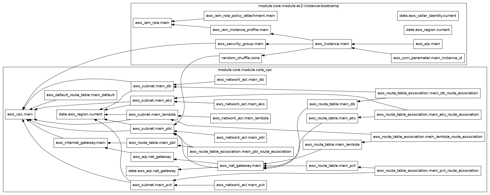

# Terraform AWS Altyapı Projesi

Bu proje, Terraform kullanarak AWS (Amazon Web Services) üzerinde altyapı sağlamak için tasarlanmıştır. Temel olarak bir VPC (Virtual Private Cloud) ve EC2 (Elastic Compute Cloud) örnekleri gibi kaynakları oluşturmayı ve yönetmeyi amaçlar. Proje, yeniden kullanılabilir modüller ve ortama özgü yapılandırmalar kullanarak altyapının tanımlanmasını ve dağıtımını kolaylaştırır.

## Proje Yapısı:

*   [`modules/`](modules/): Bu dizin, farklı AWS kaynaklarını (EC2, VPC vb.) sağlamak için yeniden kullanılabilir Terraform modüllerini içerir.
    *   [`modules/terraform-aws-ec2/`](modules/terraform-aws-ec2/): AWS EC2 örneklerini yapılandırmak ve sağlamak için kullanılan modül. Güvenlik grupları, Elastic IP'ler, IAM rolleri ve SSM yapılandırmaları gibi ilgili kaynakları içerir.
    *   [`modules/terraform-aws-vpc/`](modules/terraform-aws-vpc/): AWS VPC altyapısını yapılandırmak ve sağlamak için kullanılan modül. VPC, alt ağlar, rota tabloları, NAT ağ geçitleri ve Ağ ACL'leri gibi kaynakları içerir.
*   [`tenant/`](tenant/): Bu dizin, farklı dağıtım ortamlarına (geliştirme, hazırlık, üretim vb.) özgü yapılandırmaları içerir.
    *   [`tenant/dev/`](tenant/dev/): Geliştirme ortamı için özel yapılandırmaları içerir.
        *   [`tenant/dev/main.tf`](tenant/dev/main.tf): Geliştirme ortamı için ana yapılandırma dosyası. Genellikle `modules/` dizinindeki modülleri çağırır ve ortam değişkenlerini tanımlar.
        *   [`tenant/dev/providers.tf`](tenant/dev/providers.tf): AWS sağlayıcısı yapılandırmasını tanımlar.
        *   [`tenant/dev/core/`](tenant/dev/core/): Geliştirme ortamının çekirdek altyapı yapılandırmasını içerir.
            *   [`tenant/dev/core/ec2.tf`](tenant/dev/core/ec2.tf): EC2 modülünü kullanarak EC2 örneklerini tanımlar.
            *   [`tenant/dev/core/userdata.sh`](tenant/dev/core/userdata.sh): EC2 örnekleri başlatıldığında çalıştırılacak kullanıcı verisi betiği.
            *   [`tenant/dev/core/variables.tf`](tenant/dev/core/variables.tf): Geliştirme ortamı çekirdek yapılandırmasına özgü değişkenleri tanımlar.
            *   [`tenant/dev/core/vpc.tf`](tenant/dev/core/vpc.tf): VPC modülünü kullanarak VPC kaynaklarını tanımlar.
*   [`terraform.tfstate`](terraform.tfstate): Terraform'un yönettiği altyapının durumunu izleyen dosya.
*   [`.terraform.lock.hcl`](.terraform.lock.hcl): Terraform bağımlılıklarını kilitleyen dosya.

## Ne Yapar:

Bu proje, Terraform CLI kullanılarak çalıştırıldığında, [`tenant/dev/main.tf`](tenant/dev/main.tf) dosyasındaki yapılandırmayı okur. Bu dosya, [`modules/`](modules/) dizinindeki EC2 ve VPC modüllerini çağırarak AWS'de tanımlanan altyapıyı (belirtilen VPC, alt ağlar, EC2 örnekleri vb.) oluşturur, günceller veya siler. [`userdata.sh`](tenant/dev/core/userdata.sh) betiği, EC2 örnekleri başlatıldığında otomatik olarak belirli görevleri yerine getirmek için kullanılır.

Bu yapı, altyapıyı kod olarak yönetmeyi (Infrastructure as Code - IaC) sağlar, bu da altyapı dağıtımını tekrarlanabilir, tutarlı ve sürdürülebilir hale getirir.

## Projenin Şeması

